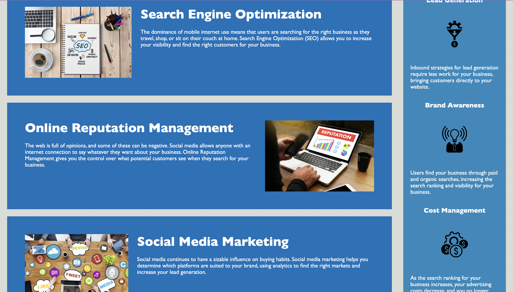

# AccessiBuild
## Description
Challenge of week one feature request challenges. Was given starter to refactor and reorginaze to look more clean and following sematic structure.Making sure all links work and css is properly commented.
## Usage
The website https://jr728.github.io/AccessiBuild/ Used to test css style of coding and linking to html style to check the css code please right click application and click inspect.
## Images

## Credits
Walter Perry (TA), pointed out that some code may not have been needed.
youtube helped add images to markdown
## License
MIT